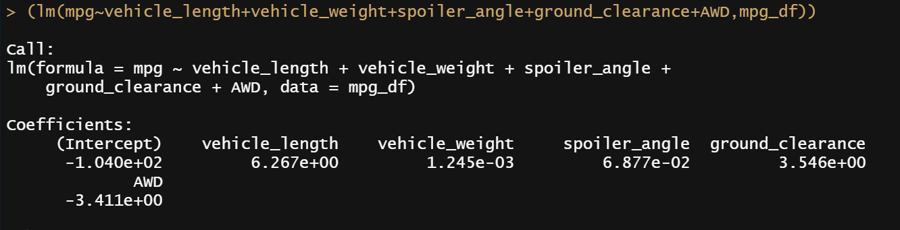

# MechaCar_Statistical_Analysis

## Overview

AutosRUs’ newest prototype, the MechaCar, is suffering from production troubles that are blocking the manufacturing team’s progress. The production data was reviewed for insights that may help the manufacturing team.
The following analysis were performed: 
- Multiple linear regression analysis to identify which variables in the dataset predict the mpg of MechaCar prototypes
- Collect summary statistics on the pounds per square inch (PSI) of the suspension coils from the manufacturing lots
- Run t-tests to determine if the manufacturing lots are statistically different from the mean population
- Design a statistical study to compare vehicle performance of the MechaCar vehicles against vehicles from other manufacturers

### Resources 

[RStudio 2021.09.2+382, R version 4.1.2](https://docs.rstudio.com/resources/install-r/)

[dplyr library](https://dplyr.tidyverse.org/)

#### Data

[MechaCar_mpg.csv](Resources/MechaCar_mpg.csv)

[Suspension_Coil.csv](Resources/Suspension_Coil.csv)

## Linear Regression to Predict MPG 

### Results

After importing our data, we perform a multiple linear regression summary using this code:

``` R
summary(lm(mpg~vehicle_length+vehicle_weight+spoiler_angle+ground_clearance+AWD,mpg_df))
```



The resulting p-values are shown under the `Pr(>|t|)` column, representing the probability of the coefficient contributing a random amount of variance to the linear model. 
The row `Signif. codes:` shows recommended levels of significance to the test (i.e. vehicle_weight measured with significance level of 0.05, denoted with `(.)`). If the values are less than the measure of significance, then these variables are statistically unlikely to provide random amounts of variance to the linear model. `vehicle_weigh`, `spoiler_angle`, and `AWD` were removed due to statistical insignificance calculated by the model, to check for stronger correlation with `mpg`. 
 


### Summary 

This multiple linear regression model showed that `vehicle_length`, `ground_clearance`, and the `intercept` have a significant impact on `mpg`. When an intercept is statistically significant, it means that the intercept term explains a significant amount of variability in the dependent variable when all independent vairables are equal to zero. Depending on our dataset, a significant intercept could mean that the significant features (such as lenght and ground clearance) may need scaling or transforming to help improve the predictive power of the model. Alternatively, it may mean that there are other variables that can help explain the variability of our dependent variable that have not been included in our model. Depending on the dataset and desired performance of the model, you may want to change your independent variables and/or transform them and then re-evaluate your coefficients and significance. 
It is worth noting that the `r-value=.7149` is a strong positive correlation, or slope. Furthermore, the `p-value = 3.637E-12` suggests using the `vehicle_length`, `ground_clearance`, and the `intercept` coefficients of this model could fair well in predicting the `mpg` of MechaCar prototypes.    

## Summary Statistics on Suspension Coils

### Results

The lot summary was imported and grouped by Manufacturing Lot:
```R
total_summary<-suspension_coil %>% summarize(Mean=mean(PSI), 
                                             Median=median(PSI), 
                                             Varience=var(PSI), 
                                             SD = sd(PSI))
```

```R
lot_summary <- suspension_coil %>% group_by(Manufacturing_Lot)%>% 
  summarize(Mean=mean(PSI), 
            Median=median(PSI),
            Varience=var(PSI),
            SD = sd(PSI), .groups = "keep")
```


### Summary

The design specifications for the MechaCar suspension coils dictate that the **variance** of the suspension coils must not exceed 100 pounds per square inch. While the total variance falls within the design specifications (**62.29**), further analysis shows disproportionate variance by lot number. `Lot 1 and 2` have a variance of **0.98** and **7.47** respectively, but `Lot 3` had a variance of **170.29**, which far exceeds the design specifications, and ought to be recalled.

## T-Tests on Suspension Coils

### Results


### Summary 


